# Compass 3.0.1 — UI/UX Screen Walkthrough

This is a screen-by-screen description of Compass's clinician-facing flow, from launch to
reading a report. It joins two kinds of evidence:

- **Seen:** what the 12 screenshots in [`../screenshots/`](../screenshots/) show. They were taken
  from the installed Compass **3.0.1** on Windows and follow one Aim test end to end: client
  `test2`, test `Aim 1`, Standard configuration, 12 trials, all correct.
- **Guide:** what the Compass **3.0** User Guide says
  ([`sources/compass-user-guide.md`](../sources/compass-user-guide.md)). Citations name a heading
  in *(italics)*, with `›` for nesting. Page numbers are not preserved.

The companion file [`ui-ux-patterns.md`](ui-ux-patterns.md) has the cross-cutting patterns,
all eight tests' defaults and the results columns, written from the guide alone. This file does
not repeat those tables. It adds what only the screenshots can show (layout, real labels,
enabled/disabled state, which data is on which screen) and links each screen to its guide
section.

The last section ([§6](#6-mapping-to-the-current-peds-eye-gaze-assessment-ui)) pairs each
Compass screen with the closest screen in our app, as a starting point for the later update.
It is a mapping, not a recommendation.

**Caveats about the screenshots.**
- Each of 01–08b is cropped to the window's client area, so the OS title bar and the menubar
  do not show in them. **Live:** a `File / Edit / Tools / Help` menubar is on every main
  screen (screenshots 10–30; menu items in
  [`ui-ux-live-verification.md` (b)](ui-ux-live-verification.md#b-newly-documented-screens-and-dialogs)).
- The help bar is fully visible in only three of 01–08b (Start, Summary, Detailed). **Live:**
  it is on every screen, including Welcome, and its text follows the control under the mouse
  or focus (for example `10-preferences.png`, `13-choose-tests-multiple.png`).
- 01–08b cover only the Aim path. Screens with no screenshot in that set are described from the
  guide in [§4](#4-screens-without-a-screenshot-guide-only); §4 now marks which of them were
  verified live and links screenshots 09–31.

---

## 1. The flow at a glance

```
01 Welcome ──Start Compass──► 02 Choose an Action
                                ├─ Create New Client ─► 03a New-client form ─Save & Continue─►
                                │                       [Save As dialog, not captured] ─► 04 Choose Skill Test(s)
                                │                                                          ─Save & Continue─► 05 Test List
                                ├─ Open Existing Client ─► 03b "Choose a Client to Open" dialog ─Open─► 05 Test List
                                └─ Quit Compass
05 Test List ─Configure Test─► 06 Aim Test Configuration ─Save & Continue / Cancel─► 05
05 Test List ─Run Test─► 07a Start Aim 1 ─Start─► [trials] ─► 07b "Test Complete!" dialog
                                                               ├─ Save ─► 05
                                                               ├─ Save and View Report ─► 08a Summary
                                                               └─ Discard Results ─► 05
05 Test List ─View Report─► 08a Summary Results ⇄ 08b Detailed Results ─Save & Continue / Cancel─► 05
```

*(Seen: the screenshot sequence. Guide: Welcome to Compass; Choose an Action; Create a New
Client; How Compass Stores Client Information; Open an Existing Client; Choosing Skill Tests;
Test List; Running Tests; Viewing Results.)*

Two structural facts set the shape of the whole app:

1. **The client file is the unit of work.** Every path goes through choosing or creating one
   client file (`.cms`) before any test can be touched. Test list, configurations and results
   all live in that one file *(How Compass Stores Client Information)*.
2. **The Test List is the hub.** Configuration, running and reports each start from it and
   return to it *(Test List; Aim Test Configuration; Viewing Results)*.

---

## 2. Visual language common to every screen (Seen)

Read off all 12 screenshots. The guide gives none of this except where cited.

| Element | What is on screen |
|---|---|
| Window | Full-screen, one screen at a time. Screens replace each other in the same window. The only separate windows in 01–08b are the file dialog (03b) and the "Test Complete" dialog (07b). **Live:** practice, recorded runs and Preview Test open a separate full-screen window titled with the test name, the Multi-Test Report is its own window, and several confirmations are modal dialogs (`20`, `25`, `27`; live-verification (b)). |
| Background | Flat light grey for the whole window. Content areas (text, lists, tables, the test canvas) are white. |
| Screen title | Large bold text, top-left, and the only heading on the screen: "Welcome to Compass!", "Choose an Action", "Enter Information for a New Client", "Choose Skill Test(s)", "Test List for test2", "Aim Test Configuration", "Start Aim 1", "Summary Results:" / "Detailed Results:". Where it names something (the client, the test), the title carries that name. |
| Grouping | Classic titled group boxes (thin border, bold title set into the top edge): "Client Info", "Evaluator Info", "Available Tests", "Tests to Add", "Feedback Options", "Target Location", "Summary of Results", "Target Map" and so on. No cards, shadows or colour coding. |
| Widgets | Standard OS widgets: text fields, drop-downs, radio buttons, check boxes, a tree, column-header tables. *(Guide: platform look-and-feel since v2.0, What Was New in Version 2.0 › Updated Look-and-Feel.)* |
| Buttons | Small, bold-labelled, same height. Actions that end the screen sit in a **centred row at the bottom** (Save & Continue / Cancel, Start / Practice / Cancel, Print Report / View Details / Save & Continue / Cancel). The one exception is the Test List, whose per-test actions are a **vertical column at the right**. |
| Disabled state | Unavailable buttons are drawn in grey, for example "Add Test >>" before anything is selected, "View Report" and "Multi-Test Report" for an unrun test, and "Save Client File" when nothing has changed. *(Guide: Test List.)* |
| Help bar | A white strip with a yellow border at the very bottom, text starting "Help:", describing the current screen (07a, 08a, 08b). *(Guide: "Screen Tips … appear in the help frame at the bottom of the Compass window", Getting Help.)* **Live:** on every screen; the text describes the control under the mouse or focus. |
| Density | Content hugs the top-left. Large stretches of the window stay empty: Choose an Action uses three buttons in a full screen; the Aim configuration uses about the left third of the width. |

---

## 3. Screen by screen (screenshot + guide)

Each entry has the same parts: what the screen is for; **Seen**; **Guide**; and, where they
exist, **Differences** between the two.

### 3.1 Welcome to Compass! — `01-welcome.png`

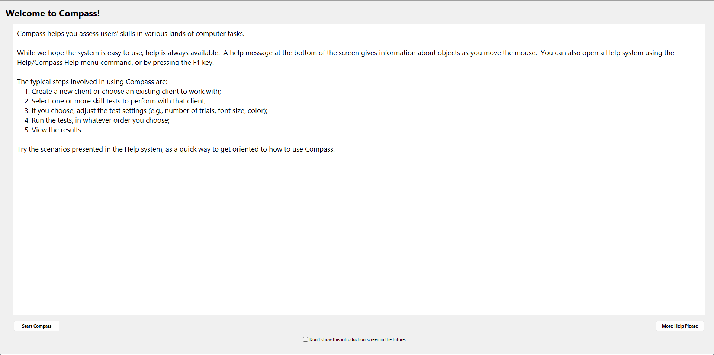

**Purpose:** orientation on start-up.

**Seen.**
- A white text panel fills most of the window. It holds a one-line description, a note that
  help is in the bottom bar and under Help/Compass Help or F1, and a five-step numbered list:
  1. create or choose a client;
  2. select skill tests;
  3. optionally adjust settings ("e.g., number of trials, font size, color");
  4. run the tests "in whatever order you choose";
  5. view the results.
- A last line points to the sample scenarios in the Help system.
- Buttons: **Start Compass** bottom-left, **More Help Please** bottom-right.
- A centred check box: "Don't show this introduction screen in the future."

**Guide.** Start Compass goes to Choose an Action; More Help Please opens the Help System; the
check box skips this screen, and Tools/Preferences › "Show welcome screen when Compass starts"
brings it back *(Welcome to Compass; Tailoring the Compass Interface)*.

**UX note (from both):** the whole workflow is taught in five numbered steps on the very first
screen, and the screen can be switched off once learnt.

### 3.2 Choose an Action — `02-choose-an-action.png`

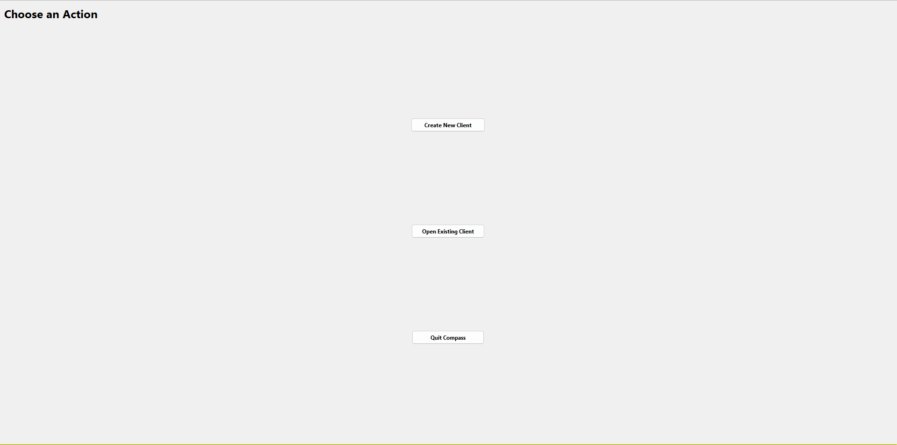

**Purpose:** pick the client to work with, or quit.

**Seen.** Three equal buttons stacked in the centre with a lot of space between them:
**Create New Client**, **Open Existing Client**, **Quit Compass**. Nothing else is on the screen.

**Guide.**
- Create New Client makes the file for a new client.
- Open Existing Client is used "even if no tests have been run yet".
- Quit Compass closes the program. Previously saved data stay available.
- Files from Compass 1.2 or earlier are converted on open, and the conversion overwrites the
  original.

*(Choose an Action.)* The same actions are on the menubar as File/New Client and File/Open
Client *(Create a New Client; Open an Existing Client)*.

### 3.3 Enter Information for a New Client — `03a-new-client-form.png`

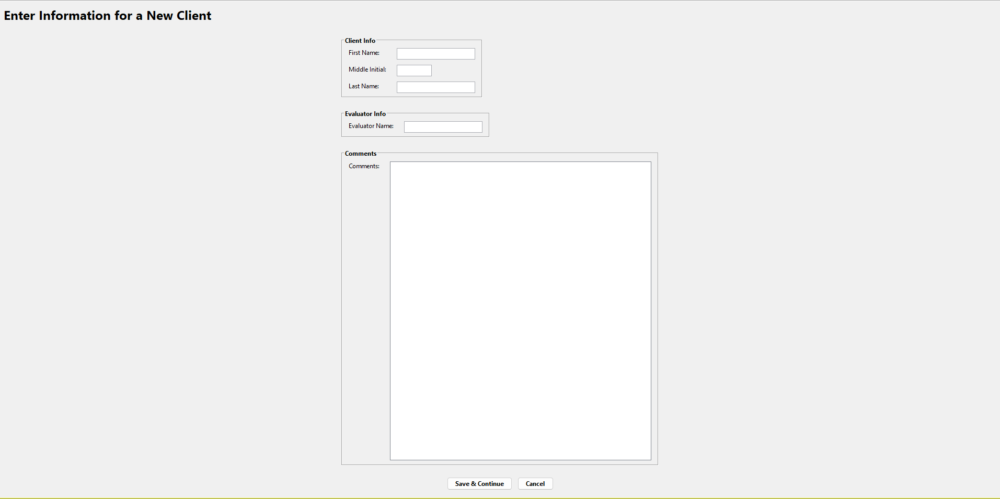

**Purpose:** identify the client before any testing.

**Seen.** Three group boxes in a narrow centred column:
- **Client Info**: First Name, Middle Initial (a short field), Last Name.
- **Evaluator Info**: Evaluator Name.
- **Comments**: one large multi-line box that takes most of the height.

Footer: **Save & Continue**, **Cancel**.

**Guide.**
- Every field may be left blank.
- The name becomes the suggested file name and is shown on the Test List. The evaluator name
  becomes the default evaluator in reports.
- Comments can hold anything that helps identify the client, "things like a registration
  number".
- Everything can be edited later under Tools/Edit Client Information.
- Save & Continue opens a **Save As** dialog. The default name is last name + first name +
  middle initial with no spaces (`Client.cms` if blank), saved in My Documents. Saving there
  goes to Choose Skill Tests.
- Cancel returns to Choose an Action.

*(Create a New Client; How Compass Stores Client Information; Edit Client Information.)*

**Not captured** in 01–08b: the Save As dialog. **Live:** `11-save-as-new-client.png`; last-used
folder (not My Documents), Files of type "All Files", default name as the guide says.

### 3.4 Choose a Client to Open — `03b-open-existing-client.png`

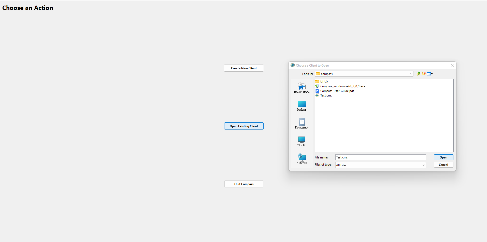

**Purpose:** reopen a client file.

**Seen.**
- A standard OS file dialog titled **"Choose a Client to Open"**, over the Choose an Action
  screen (the Open Existing Client button is shown pressed).
- It has the usual parts: Look in, a places bar, a file list (here showing `Test.cms` among
  other files), File name, Files of type, and **Open** / **Cancel**.
- Files of type reads **All Files** in this capture.

**Guide.**
- Opening a file goes straight to that client's Test List.
- Look in starts at My Documents.
- Files of type starts on `.cms`. All Files can be chosen, but only Compass files open.
- Cancel returns without opening anything.

*(Open an Existing Client.)*

**Differences.**
- The guide calls this the "Open Existing Client dialogue box"; the real title is "Choose a
  Client to Open".
- The capture shows "All Files", not the `.cms` filter the guide says it starts with.
  **Live, settled:** "All Files" **is** the default; the dialog opens in the **last-used folder**
  with the last client's file name filled in, and is a Java (Swing) chooser (`12-open-dialog.png`).

### 3.5 Choose Skill Test(s) — `04a-…-empty.png`, `04b-…-aim-added.png`

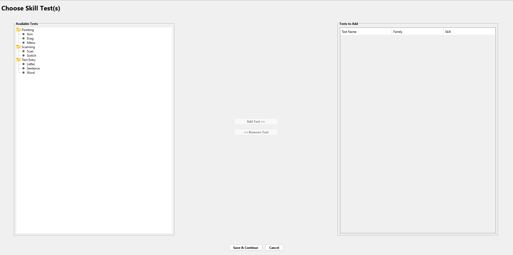
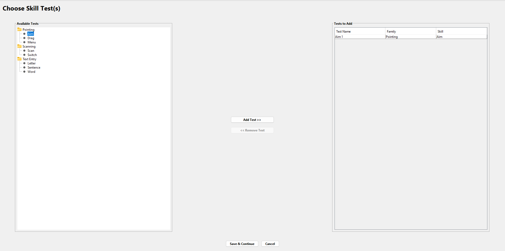

**Purpose:** build the client's list of tests.

**Seen.** A left/right transfer layout:
- **Left, "Available Tests":** a tree of three family folders, each with its tests:
  - Pointing: Aim, Drag, Menu
  - Scanning: Scan, Switch
  - Text Entry: Letter, Sentence, Word
- **Centre:** `Add Test >>` and `<< Remove Test`. In 04a both are grey. In 04b, with Aim
  selected, Add Test is active and Remove Test is still grey.
- **Right, "Tests to Add":** a table with columns Test Name / Family / Skill. In 04b it holds
  one row: `Aim 1 | Pointing | Aim`.
- Footer: **Save & Continue**, **Cancel**.

**Guide.**
- You can add with the button or by double-clicking.
- The same test can be added several times, and each copy is numbered automatically.
- Remove Test removes the selected row.
- Save & Continue saves and goes to the Test List; Cancel saves nothing.
- The screen is reached right after creating a client, or later from the Test List's Add New
  Test.
- "Compass does not try to make suggestions about which skill tests you should use."

*(Choosing Skill Tests; Skill Tests.)*

**Differences.**
- The screen title is "Choose Skill Test(s)", not "Choose Skill Tests" as in the guide.
- Within each family the tests are listed alphabetically (Scan before Switch; Letter, Sentence,
  Word). The guide's *Skill Tests* section lists them as Switch/Scan and Letter/Word/Sentence.

### 3.6 Test List for <client> — `05-test-list.png`

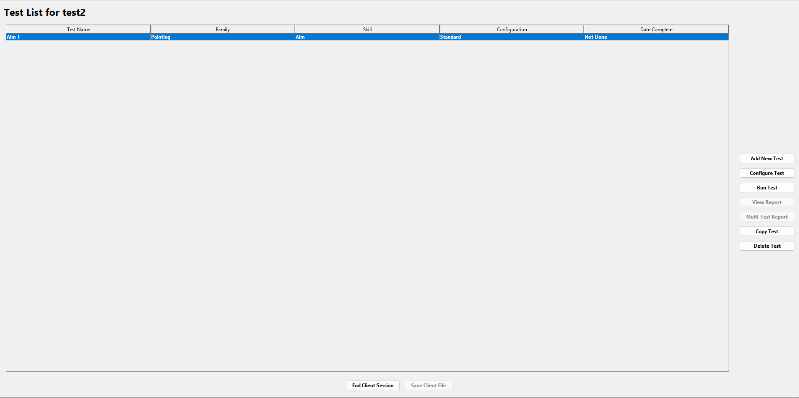

**Purpose:** the hub. Everything about a client's tests starts here.

**Seen.**
- Title **"Test List for test2"**: the client's name is in the title.
- A full-width table with columns **Test Name | Family | Skill | Configuration | Date
  Complete**. One row is selected: `Aim 1 | Pointing | Aim | Standard | Not Done`.
- A **right-hand vertical button column**, centred vertically:
  1. **Add New Test**
  2. **Configure Test**
  3. **Run Test**
  4. **View Report** *(grey)*
  5. **Multi-Test Report** *(grey)*
  6. **Copy Test**
  7. **Delete Test**
- Footer: **End Client Session**, **Save Client File** *(grey)*.

**Guide.**
- Rows for tests not yet run are bold, and clicking a column heading sorts by that column.
- A test must be selected before any action works.
- Button state follows the selected test:
  - View Report is grey until the test has run.
  - Configure Test and Run Test turn grey once it has run.
  - Multi-Test Report works only with two or more selected tests of the same skill.
- Copy Test makes an identical, unrun copy. This is how a test is repeated.
- Delete Test asks for confirmation; the Delete key and multi-select also work.
- End Client Session saves automatically once you confirm, then returns to Choose an Action.
- Save Client File saves without leaving the screen, and is grey when nothing has changed.

*(Test List.)*

**UX note (from both):** the button column shows the test's whole life (not run → configurable
and runnable; run → reportable, copyable, locked) through which buttons are greyed. The
screenshot matches the "not run" state exactly: View Report and Multi-Test Report are grey,
Configure and Run are active.

**Differences.**
- The real label is "Add New Test". The guide's Test List section calls it both "Add New Test"
  and "Add Test".
- The real label is "Save Client File". The guide also says "the **Save** button".

This settles inconsistency #3 in [`ui-ux-patterns.md` §10](ui-ux-patterns.md#10-traps-and-inconsistencies-in-the-guide)
for these two buttons.

### 3.7 Aim Test Configuration — `06-aim-configuration.png`

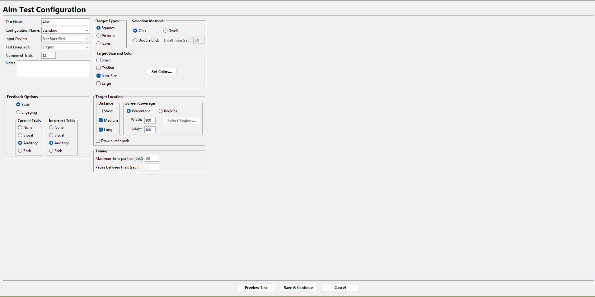

**Purpose:** set up one test before it runs. Settings are locked once it has run.

**Seen.** A multi-column grid of group boxes on the left of the window, with the footer centred
underneath.

| Column | Contents (default values as captured) |
|---|---|
| Left, top | Test Name `Aim 1` · Configuration Name `Standard` (editable drop-down) · Input Device `Not Specified` (editable drop-down) · Test Language `English` · Number of Trials `12` · Notes (multi-line) |
| Left, bottom | **Feedback Options**: Basic ● / Engaging ○; two sub-boxes **Correct Trials** and **Incorrect Trials**, each None / Visual / Auditory● / Both |
| Middle, top | **Target Types** (radio): Squares● / Pictures / Icons |
| Right, top | **Selection Method** (radio): Click● / Double Click / Dwell, with "Dwell Time (sec): 1.0" greyed while Dwell is off |
| Middle, row 2 | **Target Size and Color** (check boxes, any combination): Small / Toolbar / Icon-Size☑ / Large, plus a **Set Colors…** button |
| Middle, row 3 | **Target Location** containing **Distance** (check boxes Short / Medium☑ / Long☑) and **Screen Coverage** (Percentage● / Regions; Width `100`, Height `100`; **Select Regions…** greyed while Percentage is chosen), plus "Draw cursor path" ☐ |
| Middle, row 4 | **Timing**: Maximum time per trial (sec) `30`; Pause between trials (sec) `1` |
| Footer | **Preview Test**, **Save & Continue**, **Cancel** |

**Guide.** Each field and its default is explained in *Aim Test Configuration* and its
*Feedback Options* and *Timing* subsections:
- Click, Double Click, Dwell with a 1.0 s dwell.
- Four target sizes "approximately the size of" the window buttons, toolbar buttons, desktop
  icons, or larger.
- Short = about one-tenth of the screen width; Long = about half; Medium = twice Short.
- Percentage coverage is measured from the screen centre; Regions = six regions.
- Set Colors… opens a colour dialog with a Preview area.
- Preview Test runs a shortened version and records nothing.
- Save & Continue may require renaming a changed "Standard" configuration.

Every test's configuration screen follows the same order: names, input device, language, notes,
trials, feedback, test-specific settings, timing, then the same three buttons *(Configuring
Tests; see ui-ux-patterns.md §3)*.

**UX notes (Seen + Guide).**
- **Controls that depend on another control are greyed in place, not hidden.** Dwell Time stays
  visible but disabled until Dwell is chosen; Select Regions… stays visible but disabled until
  Regions is chosen. The operator can always see what exists.
- **Radio buttons vs check boxes match the data.** One target type and one selection method
  (radio), but any mix of sizes and distances (check boxes). This matches the guide: sizes and
  distances "can be used in any combination", while "only one type of target can be selected".
- The input device is recorded as part of the configuration because Compass "will not know" it
  *(Configuring Tests)*.

### 3.8 Start Aim 1 — `07a-start-aim.png`

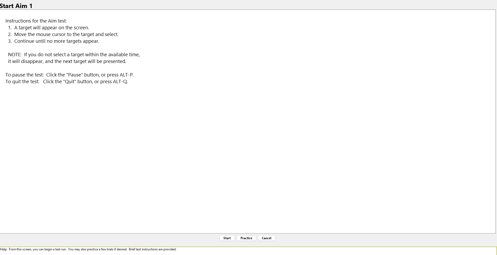

**Purpose:** a last stop before recording, with instructions and the option to practise.

**Seen.**
- Title **"Start Aim 1"**: the test's name.
- A large white panel of plain-language instructions written to be read to the client:
  1. "A target will appear on the screen."
  2. "Move the mouse cursor to the target and select."
  3. "Continue until no more targets appear."
- A NOTE about timeouts follows, then two lines: "To pause the test: Click the 'Pause' button,
  or press ALT-P. To quit the test: Click the 'Quit' button, or press ALT-Q."
- Footer: **Start**, **Practice**, **Cancel**.
- Help bar: "Help: From this screen, you can begin a test run. You may also practice a few
  trials if desired. Brief test instructions are provided."

**Guide.**
- Practice uses the same configuration with three trials, records nothing, and can be repeated.
- Start runs the test and records data.
- The written instructions are meant to be read aloud or adapted.

*(Running Tests; Tips for Using Compass › 3. Running the Tests.)*

**Differences.** The **Cancel** button on this screen is not mentioned in the guide.
**Live, settled:** all eight Start screens have Start / Practice / Cancel (`16-start-*.png`;
texts in [live-verification (d)](ui-ux-live-verification.md#d-start-screen-instructions-all-eight-tests)).

### 3.9 Running a test, and "Test Complete!" — `07b-test-complete-dialog.png`

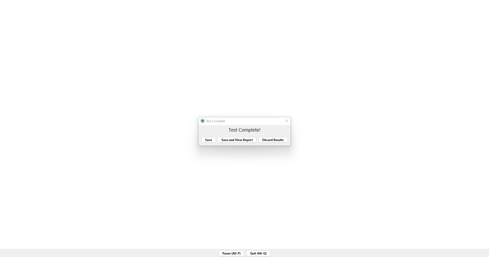

**Purpose:** the test itself, then deciding what to do with the data.

**Seen.**
- **The test canvas is the whole window, plain white.** At the bottom there is only a thin grey
  strip with two centred buttons: **Pause (Alt-P)** and **Quit (Alt-Q)**. No score, trial
  counter or timer is visible.
- When the last trial ends, a small dialog titled "Test Complete" opens in the middle, reading
  **"Test Complete!"**, with three buttons: **Save**, **Save and View Report**, **Discard
  Results**.

**Guide.**
- Pause / Re-Start (the same button) stops the stopwatch. After a pause a new trial starts and
  the interrupted trial is not recorded.
- Quit asks for confirmation, then offers to save the partial data or discard it.
- Saving lists the test as completed. Discarding leaves it "not completed", so it can be run
  again.
- Alt-P and Alt-Q work in Aim, Drag, Menu, Switch and Scan.
- On Mac the system menubar stays active during a test.

*(Running Tests; Aim Test Overview.)*

**Differences.**
- The real labels carry their shortcuts: "Pause (Alt-P)", "Quit (Alt-Q)". The guide writes
  "Pause"/"Quit".
- The real label is "Discard Results". The guide only says "discarding the results".

**Not captured** in 01–08b: the trial screen itself (a target on the canvas), the paused state,
and the Quit confirmation. **Live:** the run is a separate window named after the test (`20`);
Quit gives "Quit Test" (OK / Cancel), then "Test Complete" with only Save Partial Results /
Discard Results, while Pause reads "Re-Start (Alt-P)" (`23`, `24`).

### 3.10 Summary Results — `08a-summary-results.png`

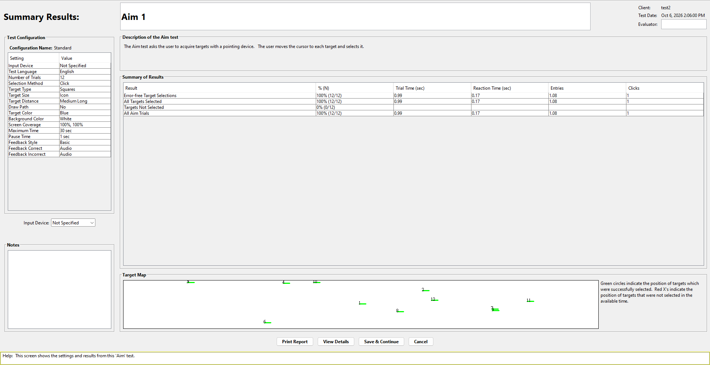

**Purpose:** a one-screen report of one test.

**Seen.** A three-zone layout.

- **Header band.** "Summary Results:" at the left. The test name **Aim 1** is in a wide box next
  to it; the test name can be edited here, per the guide. At the top-right: **Client:** `test2`,
  **Test Date:** `Oct 6, 2026 2:06:00 PM`, **Evaluator:** (an empty field).
- **Left column.**
  - **Test Configuration**: "Configuration Name: Standard", then a two-column Setting/Value
    table with 17 rows:
    - Input Device, Test Language, Number of Trials
    - Selection Method, Target Type, Target Size, Target Distance, Draw Path
    - Target Color, Background Color, Screen Coverage
    - Maximum Time, Pause Time
    - Feedback Style, Feedback Correct, Feedback Incorrect
  - Below it, an **Input Device** drop-down (`Not Specified`) and a **Notes** box.
- **Right column.**
  - **Description of the Aim test**: one sentence on what the test measures.
  - **Summary of Results**: rows Error-free Target Selections / All Targets Selected / Targets
    Not Selected / All Aim Trials; columns Result / % (N) / Trial Time (sec) / Reaction Time
    (sec) / Entries / Clicks. Captured values: `100% (12/12)`, 0.99, 0.17, 1.08, 1 for the
    selected rows; `0% (0/12)` with blank measures for Targets Not Selected.
  - **Target Map**: a wide white rectangle standing for the screen. Each target is a green mark
    with its trial number. A legend at the right reads "Green circles indicate the position of
    targets which were successfully selected. Red X's indicate the position of targets that were
    not selected in the available time."
- **Footer:** **Print Report**, **View Details**, **Save & Continue**, **Cancel**.
- **Help bar:** "Help: This screen shows the settings and results from this 'Aim' test."

**Guide.**
- The summary view opens first.
- Only Test Name, Input Device, Notes and Evaluator can be edited. The data cannot be edited,
  and they were saved already.
- Save & Continue keeps the edits; Cancel drops them; both return to the Test List.
- Print Report prints the configuration plus the summary and detailed data.
- Any table can be copied with Ctrl-C, and columns can be resized.
- On the Target Map, green circles are sized like the targets and a red X marks a miss.

*(Viewing Results; Aim Test Results.)*

**Differences.**
- **Target Map marks.** At this capture size the marks look like short horizontal green strokes,
  not circles, although the legend on the screen says "Green circles". The guide says "the size
  of the circles represents the relative size of the target". The map is drawn much wider than
  it is tall, so circles may be squashed. One screenshot cannot settle this. **Live, settled:**
  the map is about 10:1, so circles are squashed into bars; misses are red X (`21`, `21b`).
- **The configuration table uses shorter value labels than the configuration screen.** "Icon"
  instead of "Icon-Size", "Audio" instead of "Auditory", "Medium Long" for two ticked distances,
  "100%, 100%" for coverage. The detailed view (below) uses "Icon-Size" again.

### 3.11 Detailed Results — `08b-detailed-results.png`

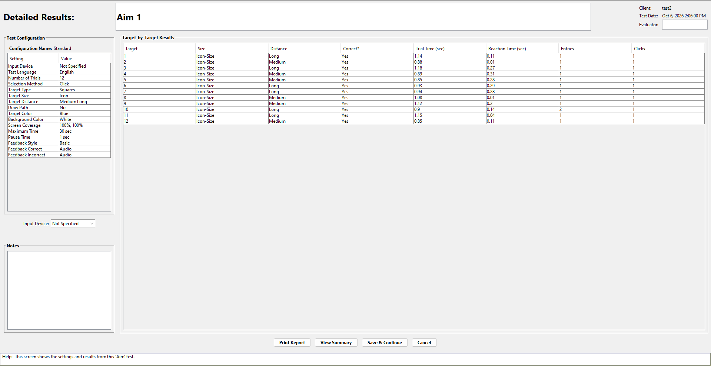

**Purpose:** the same report, one row per trial.

**Seen.**
- The header, left column and footer are identical to 08a, except the title "Detailed
  Results:" and the toggle button now reading **View Summary**.
- The right column is a single **Target-by-Target Results** table with columns:
  - Target, Size, Distance, Correct?
  - Trial Time (sec), Reaction Time (sec), Entries, Clicks
- It has 12 rows. Example: trial 10 shows `Entries = 2`.
- There is no Target Map on this view.

**Guide.** The column meanings are given in *Aim Test Results* (detailed view items 1–8). Trial
Time can exceed Maximum Time if the cursor is inside the target when time runs out.

**Consistency check (Seen, computed from the two screenshots):** the summary is the mean of the
detail rows.
- Trial Times sum to 11.91 s over 12 trials, giving 0.99. ✓
- Reaction Times sum to 2.05 s, giving 0.17. ✓
- Entries are 13 over 12 trials (trial 10 has 2), giving 1.08. ✓

So the summary row "All Aim Trials" is a plain per-trial average, as the guide's "average …
for each trial in this category" says. **Live, refined with misses:** Trial Time, Entries and
Clicks average all trials, Reaction Time only the selected ones (`21`, `22`; live-verification (e)).

---

## 4. Screens without a screenshot (guide only)

None of these is in 01–08b; the "What the guide says" column is from the guide alone. The
**Live** column (2026-10-06) says whether the screen was then seen on the running app, with its
screenshot; details are in [`ui-ux-live-verification.md`](ui-ux-live-verification.md) (b).

| Screen / dialog | What the guide says | Source heading | Live |
|---|---|---|---|
| Registration / trial dialog | On first run: free 30-day trial or register (name, email, licence code). | *Trial Period and Registration* | Verified: Free Trial / Register... buttons, days left; extension contact is support@ (`09`). Register... form not opened |
| Save As (new client) | Default name from the client's name, `.cms` added automatically, My Documents. Cancel returns to the new-client form. | *How Compass Stores Client Information* | Verified, differs: last-used folder, Files of type "All Files" (`11`) |
| Edit Client Information | The new-client fields, editable at any time from Tools. Save and Continue / Cancel. | *Edit Client Information* | Verified: full screen; buttons "Save & Continue" / "Cancel" (`30`) |
| Preferences | Two check boxes: show the welcome screen, show tooltips. OK / Cancel. | *Tailoring the Compass Interface* | Verified: both on one row, both checked (`10`) |
| Tool tip + screen tip | A tool tip near the cursor (can be switched off); a screen tip in the bottom help frame (always on). | *Getting Help* | Screen tip verified on every screen; tool tips not captured |
| Set Colors… (Aim) | Three rows of preset white/black/blue target-on-background swatches, a Background row, a Target row, a Preview area, OK / Cancel. | *Aim Test Configuration › Target Size and Color* | Verified: title "Select Target and Background Colors"; adds More Background / More Target Colors buttons (`17`) |
| Select Regions… (Aim) | A box standing for the screen, split into six regions. Toggle by click or Tab + Space. At least one must stay selected. | *Aim Test Configuration › Target Location* | Verified: 3 x 2 grid, all unshaded when first opened (`18`, `18b`) |
| Configuration rename prompt | Shown when a changed "Standard" configuration is saved. | *Configuring Tests* | Verified: "Compass Warning", OK only, no name field (`19`) |
| Trial screen (Aim) | One target at a time. The next appears when the target is selected, or after the maximum time. | *Aim Test Overview* | Separate full-screen window seen (`20`); a target on screen not captured. Drag preview seen (`25`) |
| Quit confirmation, then save/discard partial data | | *Running Tests* | Verified: two dialogs (`23`, `24`) |
| Delete Test confirmation | | *Test List* | Verified: "Delete Test", Yes / No (`29`) |
| Multi-Test Report | An evaluator-name prompt and OK, then a separate paginated window containing a speed-accuracy profile, accuracy and speed bar graphs with a description of each, a data table, and each test's configuration. Previous / Next / Print / Save (RTF or PDF) / Close; asks to save on close. | *Multi-Test Reports* | Verified: prompt, 4 pages A–E, "Close Report" asks Yes / No / Cancel (`26`, `27-p1..p4`, `28`). Save format not captured |
| The other seven tests' configuration and results screens | The same structure as Aim; settings and columns are in [`ui-ux-patterns.md` §3–§5](ui-ux-patterns.md#3-anatomy-of-a-configuration-screen). The guide's generic configuration illustration is a **Menu** test. | *Configuring Tests*; each test's chapter | Configuration screens and Start screens verified for all eight (`15-config-*`, `16-start-*`); results screens not captured |
| End Client Session prompt; Test List after runs | (Test List: saves after confirming) | *Test List* | Verified: "Close Client", Yes / No (`31`); list states (`14`) |

---

## 5. UX principles the screens demonstrate

Each principle is visible on a screenshot and stated in the guide.

1. **One linear path with one hub.** Welcome, then Action, then Client, then Tests, then the
   Test List hub. From the hub you go to Configure, Run or Report, and every one of them comes
   back to the hub. Nothing branches off it. *(§1; Test List.)*
2. **Screen titles name the object.** "Test List for test2", "Start Aim 1", "Aim 1" in the
   report header. The operator always sees which client and which test they are on. *(Seen.)*
3. **What you can do is shown by enable/disable, never by hiding.** Test List buttons, Add/Remove
   Test, Dwell Time and Select Regions… all stay visible and go grey when unavailable.
   *(Seen; Test List.)*
4. **Run once, then locked; repeat by copying.** Configuration and Run grey out after a run, and
   Copy Test makes a fresh identical test, so comparisons are like-for-like. *(Test List;
   Configuring Tests.)*
5. **No recording without a deliberate step, and an exit at every stage.** Preview Test (on the
   configuration screen) and Practice (on the Start screen) record nothing. After a run, the
   operator explicitly chooses Save, Save and View, or Discard. *(Seen 06, 07a, 07b; Running
   Tests.)*
6. **Instructions to read aloud come before every run,** in plain language, with the pause/quit
   keys repeated. *(Seen 07a; Tips for Using Compass › 3.)*
7. **The client sees only the task.** During a run the window is a blank canvas with two small
   operator buttons; there is no score or counter on screen. *(Seen 07b.)*
8. **A report is a self-contained document.** It holds the client, date, evaluator, the full
   configuration, a plain-language description of the test, results, a map, and notes, and it
   can be printed. *(Seen 08a; Viewing Results.)*
9. **Summary first, detail on demand,** in the same frame, with one toggle button. *(Seen 08a/08b.)*
10. **Record what the software cannot know.** Input Device and Evaluator are asked for on the
    configuration screen and again on the report. *(Seen 06, 08a; Configuring Tests.)*
11. **Help is always on screen.** A one-line help bar describes the current screen, with tool
    tips and F1 on top. *(Seen 07a/08a/08b; Getting Help.)*

---

## 6. Mapping to the current peds-eye-gaze-assessment UI

**What this compares.** Our UI is as of `main` on 2026-10-06, which is 47 commits after the
`v1.0.0` tag. Some entries in the right-hand column (Display check, HUD hide, task settings
profiles, target-size presets) postdate v1.0.0.

Our side was read from `src/ui/` (`setup_page.py`, `tasks_page.py`, `task_settings_dialog.py`,
`operator_panel.py`, `results_page.py`, `dashboard_window.py`).

**What this table does not do.** It does not recommend changes; that is for the later SPEC.
"None" means no counterpart was found, not that one is needed.

| # | Compass screen / pattern | Closest in our app | Notes on the difference (facts only) |
|---|---|---|---|
| 1 | Welcome (01), can be switched off | None | The dashboard opens on the Setup tab. |
| 2 | Choose an Action (02) | None | No separate start screen. Navigation is the persistent `1 · Setup / 2 · Tasks / 3 · Results` bar. |
| 3 | New-client form (03a): name, evaluator, comments | Setup tab, **Subject & Session Info** card: Subject ID (with autocomplete over known subjects), Assessment Date, Sex, Notes | We have no evaluator field. The subject is identified by an ID, not a name. |
| 4 | Client file `.cms`: one file holds everything; Open Existing Client (03b) | Per-run session folders on disk; per-subject saved calibration and settings profiles found by Subject ID | No single client file and no open-file step. A returning subject is picked up by typing their ID. |
| 5 | None | Setup tab: tracker connection, Display check, calibration (Do / Load / Save Calibration, View Calibration Details) | Compass has no device-connection or calibration step. In our app these gate "Continue to Tasks →". |
| 6 | Choose Skill Test(s) (04): build a per-client test list, the same test can be added several times | Tasks tab: four fixed task cards (Static Click, Grid Click, Follow & Click, Scanning Search) | No per-subject test list. There is no add/remove step, and a task is not an object with its own name. |
| 7 | Test List hub (05): status column, button state follows the test's life, Copy / Delete | Tasks tab cards: **Run**, **Settings**, **Load Settings**, **Analyze** per card | We have no Date Complete / Not Done status column, no lock after a run, and no Copy or Delete. A task can be run again directly. |
| 8 | Configuration screen (06): locked after the run, named configuration "Standard", Preview Test | **Task settings dialog** (opened on Run; its OK button is "Start task"), Save for this subject / Load Settings profiles, Reset to defaults; live changes during a run from the operator panel | Our settings stay changeable during and between runs, so nothing locks. We have no configuration name shown on a list, and no Preview. |
| 9 | Start screen (07a): instructions to read aloud, **Practice** | Task settings dialog → "Start task" | We have no instructions screen and no practice mode. |
| 10 | Run screen (07b): blank canvas, Pause (Alt-P) / Quit (Alt-Q) | Task canvas plus operator panel (HUD cards): Pause / Resume, Skip trial, End task, Hide HUD (H key); live Gaze / FPS / Device / Trial readouts and hit/timeout counters | Our operator panel shows live metrics next to the canvas; it can be hidden. Compass shows none. |
| 11 | "Test Complete!" dialog: Save / Save and View Report / **Discard Results** | None. The run returns straight to the Tasks tab and the data are always written | We have no end-of-run decision and no discard. |
| 12 | Summary report (08a): header with client/date/evaluator, configuration table, description, results table, Target Map, Notes, Print | **3 · Results** tab (via Analyze or the nav button): a four-category metrics table (Data quality / Fixation / Saccade / Selection) plus the Session Log; CSV/JSON exports in the session folder | Our Results tab has no configuration table, no target map, no notes/evaluator fields and no print. Its measures are gaze-specific. |
| 13 | Detailed report (08b): one row per trial, toggled with View Details / View Summary | Per-trial and per-sample CSV exports (for example `all_gaze.csv`, `fixations.csv`) | There is no per-trial table on screen. |
| 14 | Multi-Test Report: compare tests of the same skill | None | |
| 15 | Input Device field (configuration and report) | Not applicable as a field. The input mode (eye / switch) is set in config | |
| 16 | Help bar + tool tips + F1 Help System | Tool tips in `operator_panel`, `setup_page`, `slider_spin` and `tasks_page` | We have no always-visible help bar and no help system. |
| 17 | Windows-native look, grey chrome, titled group boxes | Custom dashboard theme (`wtmh_theme.py`): cards, scoped stylesheet, forest task theme | The visual languages differ completely. Compass follows the OS look. |

---

## 7. Provenance

- Screenshots were captured by the user on 2026-10-06 from `Compass_windows-x64_3_0_1.exe`. They
  were copied unchanged into `screenshots/` and renamed in flow order. The original file names
  are in the table below.
- The guide is the 3.0 edition (copyright 2019); the app is 3.0.1. The differences flagged in §3
  may come from that version gap or from the guide's own inconsistencies. This file does not
  try to tell which.
- The client name `test2` and the 2026-10-06 date are the user's own test session, not Compass
  sample data.
- **Live (2026-10-06):** screenshots `09-*` to `31-*` (some cropped to the dialog) and every
  "Live" note here come from a later driven session on the installed 3.0.1 (Java Access Bridge,
  coordinate clicks, throwaway client "Probe JabTest"); method and limits are in
  [`ui-ux-live-verification.md`](ui-ux-live-verification.md).

| In this folder | Original file (`resources/compass/UI-UX/`, outside the repo) |
|---|---|
| `01-welcome.png` | `first-menu.png` |
| `02-choose-an-action.png` | `second-menu.png` |
| `03a-new-client-form.png` | `third-menu-new-client.png` |
| `03b-open-existing-client.png` | `third-menu-existing-client.png` |
| `04a-choose-skill-tests-empty.png` | `fourth-menu-if-choose-new-client.png` |
| `04b-choose-skill-tests-aim-added.png` | `fourth-menu-if-choose-new-client-after-choose-test.png` |
| `05-test-list.png` | `fifth-menu-either-after-fourth-menu-if-choose-new-client-after-choose-test-or-third-menu-existing-client.png` |
| `06-aim-configuration.png` | `sixth-menu-configure-test.png` |
| `07a-start-aim.png` | `seventh-menu-run-test.png` |
| `07b-test-complete-dialog.png` | `seventh-menu-run-test-modal-after-finishing-test.png` |
| `08a-summary-results.png` | `eight-menu--report-menu-summary-result.png` |
| `08b-detailed-results.png` | `eight-menu--report-menu-detailed-result.png` |
